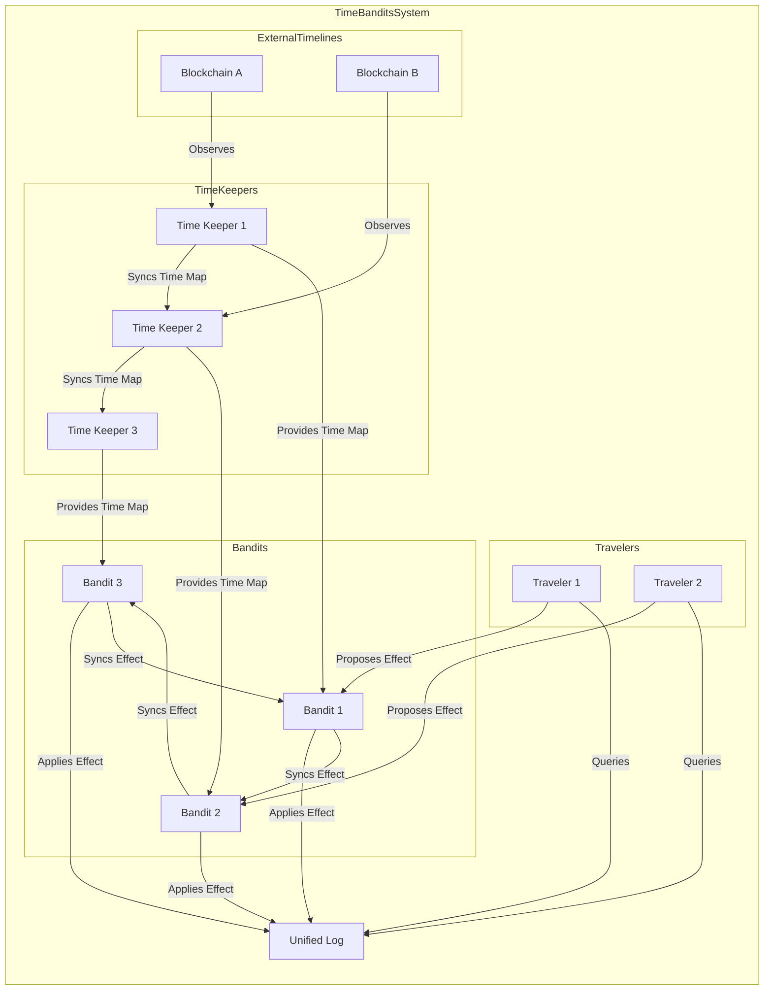

# Time-Bandits Architecture Diagram

This diagram illustrates the key components and relationships of the Time-Bandits system.

Key Objects:

- Time Keepers: Nodes responsible for observing external timelines (e.g., blockchains) and maintaining synchronized time maps.​
- Bandits: Executor nodes that apply effects proposed by travelers, update the unified log, and synchronize effects among themselves.​
- Travelers: Users or entities that propose effects (actions or transactions) to be executed within the Time Bandits system.​
- External Timelines: External systems or blockchains that Time Keepers observe to maintain accurate time maps.​
- Unified Log: A centralized log that records all applied effects, ensuring consistency and traceability within the system.​

Key Interactions:

- Time Keepers observe external timelines to gather data and synchronize time maps among themselves.​
- Bandits receive these synchronized time maps from Time Keepers to ensure they operate based on the latest external state.​
- Travelers propose effects to Bandits, which are then applied and recorded in the unified log.
- Bandits synchronize applied effects among themselves to maintain system-wide consistency.​
- Travelers can query the unified log to verify the status and history of applied effects.​