# Time-Bandits Architecture Diagram

This diagram illustrates the key components and relationships of the Time-Bandits system.

```mermaid
flowchart TB
    %% Styling
    classDef core fill:#e1f5fe,stroke:#01579b,stroke-width:1px
    classDef programs fill:#e8f5e9,stroke:#2e7d32,stroke-width:1px
    classDef actors fill:#fff3e0,stroke:#e65100,stroke-width:1px
    classDef execution fill:#f3e5f5,stroke:#7b1fa2,stroke-width:1px
    classDef adapters fill:#fffde7,stroke:#fbc02d,stroke-width:1px
    classDef proofs fill:#e8eaf6,stroke:#3f51b5,stroke-width:1px
    classDef cli fill:#fce4ec,stroke:#c2185b,stroke-width:1px
    
    %% CORE Components
    subgraph CorePackage["Core"]
        direction TB
        subgraph EffectSystem["Effect System"]
            Effect["Effect"]
            EffectId["EffectId"]
            EffectResult["EffectResult"]
        end
        
        subgraph TimeMap["TimeMap"]
            TimelineState["TimelineState"]
            ResourceTracking["ResourceTracking"]
        end
        
        subgraph Resource["Resource"]
            ResourceTypes["ResourceTypes"]
            ResourceLedger["ResourceLedger"]
        end
        
        subgraph Timeline["Timeline"]
            TimelineDescriptor["TimelineDescriptor"]
        end
    end
    
    %% PROGRAMS Components
    subgraph ProgramsPackage["Programs"]
        direction TB
        subgraph ProgramComponent["Program"]
            ProgramDefinition["ProgramDefinition"]
            ProgramInstance["ProgramInstance"]
        end
        ProgramEffect["ProgramEffect"]
        PreconditionEvaluator["PreconditionEvaluator"]
        Scenario["Scenario"]
    end
    
    %% ACTORS Components
    subgraph ActorsPackage["Actors"]
        direction TB
        subgraph TimeTraveler["TimeTraveler"]
            TravelerProgramExecution["ProgramExecution"]
            TravelerEffectSubmission["EffectSubmission"]
        end
        
        subgraph TimeKeeper["TimeKeeper"]
            KeeperEffectValidation["EffectValidation"]
            KeeperTimelineConsensus["TimelineConsensus"]
        end
        
        subgraph TimeBandit["TimeBandit"]
            BanditTimelineAttack["TimelineAttack"]
            BanditResourceTheft["ResourceTheft"]
        end
        
        subgraph ActorCommunication["ActorCommunication"]
            TransitionMessage["TransitionMessage"]
            ActorCoordination["ActorCoordination"]
        end
    end
    
    %% EXECUTION Components
    subgraph ExecutionPackage["Execution"]
        direction TB
        subgraph EffectInterpreter["EffectInterpreter"]
            EffectExecutor["EffectExecutor"]
        end
        
        subgraph ExecutionLog["ExecutionLog"]
            DistributedLog["DistributedLog"]
            Events["Events"]
        end
        
        LocalMultiProcess["LocalMultiProcess"]
    end
    
    %% ADAPTERS Components
    subgraph AdaptersPackage["Adapters"]
        direction TB
        TimelineAdapter["TimelineAdapter"]
        
        subgraph ExternalTimelines["External Timelines"]
            EthereumAdapter["EthereumAdapter"]
            CelestiaAdapter["CelestiaAdapter"]
            OtherAdapters["Other Adapters"]
        end
        
        subgraph NetworkAdapter["NetworkAdapter"]
            NetworkQUIC["NetworkQUIC"]
        end
    end
    
    %% PROOFS Components
    subgraph ProofsPackage["Proofs"]
        direction TB
        TimelineProof["TimelineProof"]
        ZKProof["ZKProof"]
        SecurityVerifier["SecurityVerifier"]
    end
    
    %% CLI Components
    subgraph CLIPackage["CLI"]
        direction TB
        Main["Main"]
        Controller["Controller"]
    end
    
    %% Core internal relationships
    Effect --> EffectId
    Effect --> EffectResult
    Effect --> Resource
    TimeMap --> Timeline
    TimeMap --> ResourceTracking
    
    %% Program internal relationships
    ProgramComponent --> ProgramDefinition
    ProgramComponent --> ProgramEffect
    ProgramComponent --> PreconditionEvaluator
    Scenario --> ProgramComponent
    
    %% Actor internal relationships
    TimeTraveler --> TravelerProgramExecution
    TimeTraveler --> TravelerEffectSubmission
    TimeKeeper --> KeeperEffectValidation
    TimeKeeper --> KeeperTimelineConsensus
    TimeBandit --> BanditTimelineAttack
    ActorCommunication --> TransitionMessage
    ActorCommunication --> ActorCoordination
    
    %% Cross-package relationships
    ProgramsPackage --> CorePackage
    ActorsPackage --> CorePackage
    ActorsPackage --> ProgramsPackage
    ExecutionPackage --> CorePackage
    AdaptersPackage --> CorePackage
    ProofsPackage --> CorePackage
    CLIPackage --> ActorsPackage
    
    %% Detailed dataflow
    TimeTraveler --> ProgramComponent
    ProgramComponent --> Effect
    Effect --> EffectInterpreter
    EffectInterpreter --> TimelineAdapter
    TimelineAdapter --> ExternalTimelines
    TimeKeeper --> EffectInterpreter
    TimeKeeper --> ExecutionLog
    TimeBandit --> TimelineAdapter
    ExecutionLog --> TimelineProof
    
    %% Apply styling
    class Effect,EffectId,EffectResult,TimeMap,TimelineState,ResourceTracking,Resource,ResourceTypes,ResourceLedger,Timeline,TimelineDescriptor core
    class ProgramComponent,ProgramDefinition,ProgramInstance,ProgramEffect,PreconditionEvaluator,Scenario programs
    class TimeTraveler,TravelerProgramExecution,TravelerEffectSubmission,TimeKeeper,KeeperEffectValidation,KeeperTimelineConsensus,TimeBandit,BanditTimelineAttack,BanditResourceTheft,ActorCommunication,TransitionMessage,ActorCoordination actors
    class EffectInterpreter,EffectExecutor,ExecutionLog,DistributedLog,Events,LocalMultiProcess execution
    class TimelineAdapter,ExternalTimelines,EthereumAdapter,CelestiaAdapter,OtherAdapters,NetworkAdapter,NetworkQUIC adapters
    class TimelineProof,ZKProof,SecurityVerifier proofs
    class Main,Controller cli
```

## Execution Flow

The Time-Bandits system follows this general execution flow:

1. **Programs define effects** - Programs specify what operations should be performed on timelines
2. **Effects are validated by preconditions** - Before execution, effect validity is checked
3. **Time Travelers execute programs** - They initiate the execution of time-travel operations
4. **Effects are processed by interpreters** - The core system interprets and routes effects
5. **Time Keepers validate and maintain timelines** - They ensure timeline integrity
6. **Execution results are logged** - All operations are recorded in a distributed log
7. **Proofs verify execution integrity** - Cryptographic proofs ensure all operations are valid
8. **Time Bandits attempt to exploit timelines** - They test the security of the system

## Key Component Descriptions

### Core
- **Effect System**: Defines all possible operations that can be performed across timelines
- **TimeMap**: Maintains the state of all timelines and resources
- **Resource**: Represents assets that can be manipulated by effects
- **Timeline**: Represents a sequence of effects that have been applied

### Programs
- **Program**: Defines a sequence of effects to be executed
- **PreconditionEvaluator**: Validates whether effects can be applied
- **Scenario**: Composes multiple programs for complex simulations

### Actors
- **TimeTraveler**: Executes programs and submits effects
- **TimeKeeper**: Validates effects and maintains timeline consensus
- **TimeBandit**: Attempts to attack timelines and steal resources
- **ActorCommunication**: Enables message passing between actors

### Execution
- **EffectInterpreter**: Processes and routes effects to appropriate timelines
- **ExecutionLog**: Records all effect applications for verification
- **LocalMultiProcess**: Manages execution across multiple processes

### Adapters
- **TimelineAdapter**: Connects to external timelines like Ethereum and Celestia
- **NetworkAdapter**: Handles communication between distributed components

### Proofs
- **TimelineProof**: Verifies the integrity of timeline operations
- **ZKProof**: Provides zero-knowledge proofs for private operations
- **SecurityVerifier**: Validates the security properties of the system 